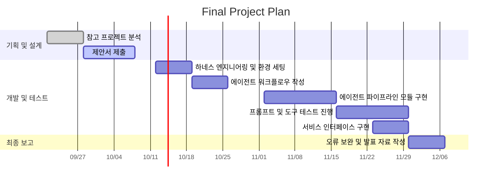

# 1. 프로젝트 개요

## 1.1. 기본 정보
- 프로젝트 제목 : 
-  작성일자 : 
-  학번 /이름 : 

# 2. 서론 및 배경

## 2.1. 배경
- 문제 정의 : 
- 제안 배경 : 

## 2.2. 기여점
- 참고 프로젝트 주제 : 
- 기존 프로젝트와의 차별성 :

# 3. 상세 내용

## 3.1. 개발 목표 및 접근법
- 정량적/정성적 달성 목표 : 
- 핵심 에이전트 루프 및 접근법 : 

## 3.2. 시스템 아키텍처

- 에이전트 워크플로우 : (ex- 입력 -> 계획/추론 -> 도구 호출 -> 결과 생성 흐름 서술 & 다이어그램 첨부)

## 3.3. 입출력 인터페이스

- 입력 형태 : (ex - 텍스트 질의 챗봇 화면, PDF 문서 업로드 화면 등)
- 최종 형태 : (ex - 마크다운 보고서 다운로드 화면, 구조화된 JSON 데이터를 그래프로 보여주는 대시보드 등)

# 4. 개발 환경

## 4.1. 모델 및 예상 비용
- 기반 LLM 모델 : (ex - gpt-4o-mini, claude-3-5-sonnet 등)
- 예상 API 비용 : (ex - 개발 및 테스트 기준 예상 토큰 수와 예상 비용 산정)

## 4.2. 프레임워크 및 연계 기술
- 에이전트 프레임워크 : (ex - LangChain, LangGraph, CrewAI 등)
- 모델 외 연계 기술 : (ex - Function Calling, Tool Use, RAG, Memory 등)
- 외부 연동 도구 및 API : (ex - 웹 검색 API, 계산기, 개인 DB 연동 등)

## 4.3. 실행 환경
- 개발 언어 및 환경 : (ex - Python 3.11 등 )
- 주요 라이브러리 및 배포 도구 : (ex - Streamlit, PyMuPDF, ChromaDB 등)

# 5. 수행 계획

## 5.1. 개발 일정
- 6~7주차 : (ex - 하네스 엔지니어링 적용 환경 세팅 및 에이전트 워크플로우 작성)
- 9~12주차 : (ex - 에이전트 파이프라인 모듈 구현 및 프롬프트/도구 테스트 진행)
- 12~14주차 : (ex - 서비스 인터페이스 구현, 오류 보완 및 기말 발표 자료 작성)

# 6. 참고 문헌
- 논문 : 
-  오픈소스 저장소(Github URL) : 
-  기타 데이터셋 출처 URL : 
